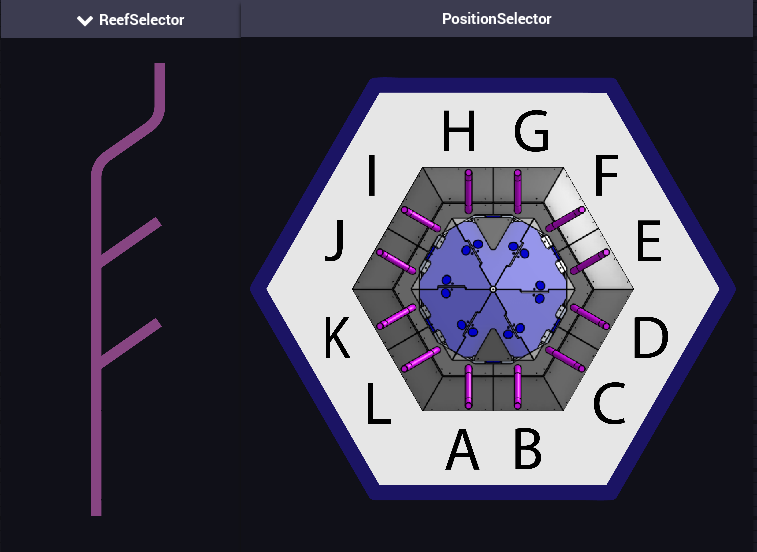

# Reef Selector Shuffleboard Widget
This is a Shuffleboard widget for the 2025 FRC Game Reefscape, which uses data from NetworkTables to display currently selected reef positions (both Level, and Position) for an operator to select.

## Installation
To install this widget, download the latest release from Github Actions, or build it yourself using the instructions below.

## Building
To build, run `./gradlew :ReefSelector:installPlugin` in the root directory of this repository, and the plugin will be placed in your user's Shuffleboard plugin directory automatically.

## Usage
To use either widget, drag it to the shuffleboard dashboard and associated it with a string value. Acceptable values for the level widget are `L2`, `L3`, and `L4`. Acceptable values for the position widget are `A` through `L`.

## Images
